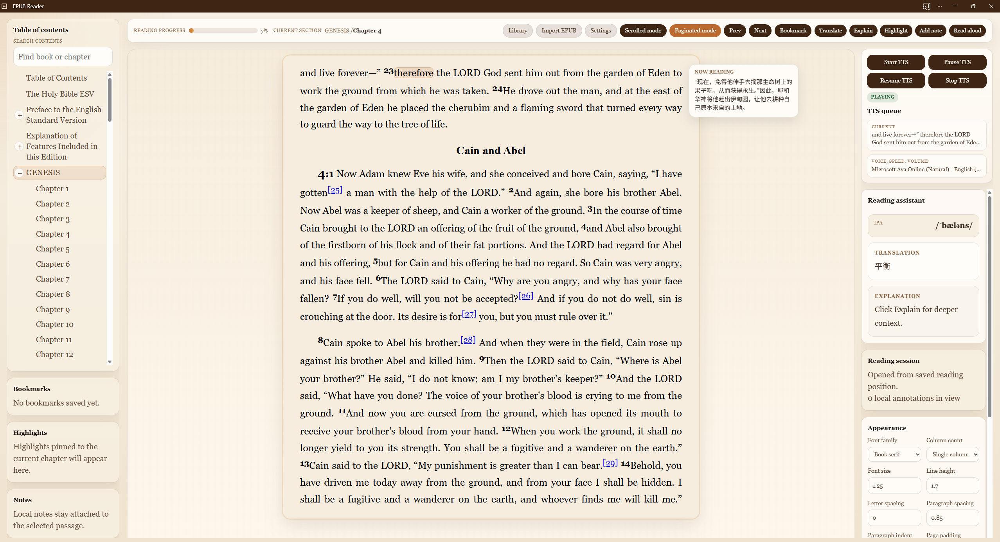

# EPUB Reader / EPUB 英语阅读器

这是一个面向中文用户的 EPUB 阅读器，目标是让英语阅读与听力练习更顺手、更连贯。

This is an EPUB reader for Chinese users who want a smoother workflow for English reading and listening practice.

它把书籍正文、翻译、解释和朗读控制放在同一个界面里，减少在阅读器和翻译器之间来回切换的打断感，并借助 LLM 提高语境翻译的准确度。

It keeps the book, translation, explanation, and TTS controls in one interface, so readers do not have to bounce between an EPUB reader and a separate translator. It also uses LLM-assisted translation to improve contextual accuracy.

这个项目主要希望帮助尝试学习英语阅读与听力的中国小伙伴，在尽量少打断节奏的前提下持续阅读、听书和理解上下文。

This project is built to help Chinese learners stay inside the text, keep listening and reading, and get help from contextual translation without constantly breaking focus.

推荐使用 Microsoft Edge，可获得最佳听书体验，尤其是在英文自然语音、连续朗读和同步高亮方面。

Microsoft Edge is recommended for the best listening experience, especially for natural English voices, continuous playback, and synced highlighting.



## 为什么做这个项目 / Why This Project Exists

很多 EPUB 阅读器把翻译、解释和 TTS 当成互相分离的任务。对语言学习者来说，这会形成一个很糟糕的循环：

Many EPUB readers treat translation, explanation, and TTS as separate tasks. For language learners, that often creates a frustrating loop:

- 读一句
- 切去翻译器
- 再切回书
- 上下文断掉
- 重复这个过程

- read a line
- switch to a translator
- switch back to the book
- lose context
- repeat

这个阅读器的目标就是尽量消除这条链路，让读者可以留在正文里完成阅读、翻译、解释和听书。

The goal of this reader is to remove that loop as much as possible, so users can stay inside the book while reading, translating, explaining, and listening.

## 核心体验 / Core Experience

- 在阅读页内直接翻译和解释，不需要离开当前页面  
  In-reader translation and explanation without leaving the current page
- 利用语境和 LLM 提高单词、多词短语与句子的翻译准确度  
  Context-aware LLM translation for better word and phrase disambiguation
- 为桌面阅读设计的 TTS 控制与同步高亮，推荐在 Microsoft Edge 中获得最佳听书体验  
  Desktop-friendly TTS controls and synced highlighting, with the best listening experience recommended on Microsoft Edge
- 同时支持 `paginated` 和 `scrolled` 两种阅读模式  
  Supports both `paginated` and `scrolled` reading modes
- 本地优先的书签、笔记和高亮  
  Local-first bookmarks, notes, and highlights
- 可切换本地模型与 Gemini 在线翻译  
  Configurable AI providers for local models and Gemini online translation

## 开发 / Development

安装依赖并启动开发环境：

Install dependencies and start the development server:

```bash
npm install
npm run dev
```

常用命令：

Useful commands:

```bash
npm test
npm run e2e
npm run build
```

## AI 提供方 / AI Providers

当前支持两种翻译 provider：

The reader currently supports two translation providers:

- `Local LLM`
- `Gemini BYOK`

这两种方式都可以在以下位置配置：

Both can be configured in:

- 全局 `Settings`
- 阅读页右侧的 `Appearance` 面板

- global `Settings`
- the in-reader `Appearance` panel

## 浏览器建议 / Browser Recommendation

推荐使用 Microsoft Edge 来获得最佳 TTS 听书体验。当前项目的朗读链路基于浏览器原生 `speechSynthesis`，而在桌面版 Edge 中，英文自然语音、连续朗读与高亮同步通常表现最好。

Microsoft Edge is recommended for the best TTS listening experience. The reader uses the browser-native `speechSynthesis` pipeline, and desktop Edge typically provides the best results for natural English voices, continuous playback, and highlight sync.

### Local LLM

- 默认地址：`http://localhost:8001/v1/chat/completions`  
  Default endpoint: `http://localhost:8001/v1/chat/completions`
- 支持填写：
  - `/v1`
  - `/v1/chat/completions`
  - `/v1/completions`
- The app normalizes these forms internally.
- 应用会自动请求 `/v1/models`，填充本地模型下拉菜单。  
  The app also queries `/v1/models` to populate the local model dropdown.
- 如果模型列表无法加载，请确认你的 OpenAI-compatible 服务暴露了 `GET /v1/models`，并且允许浏览器从当前页面来源访问。  
  If the model list does not load, verify that your OpenAI-compatible server exposes `GET /v1/models` and allows browser access from the app origin.

### Gemini BYOK

- 界面当前支持：
  - `gemini-2.5-flash`
  - `gemini-2.5-flash-lite`
- Supported models in the UI:
  - `gemini-2.5-flash`
  - `gemini-2.5-flash-lite`
- 浏览器会直接使用你自己的 Gemini API key 发起请求。  
  The app calls Gemini directly from the browser using your own API key.
- key 只保存在当前浏览器的本地设置中，不会打包进应用，也不应该提交到仓库。  
  The key is stored only in this browser's local settings. It is not bundled into the app and must never be committed to the repo.

## 如何申请 Gemini API Key / How To Get A Gemini API Key

可以通过 Google AI Studio 申请：

Use the official Google AI Studio flow:

1. 打开 [Google AI Studio](https://ai.google.dev/aistudio)。  
   Open [Google AI Studio](https://ai.google.dev/aistudio).
2. 使用你的 Google 账号登录。  
   Sign in with your Google account.
3. 点击 **Get API key**。  
   Click **Get API key**.
4. 在 AI Studio 的 API keys 页面创建新的 key。  
   Create a new key from the AI Studio API keys page.
5. 复制 key，并妥善保管，不要泄露。  
   Copy the key and keep it private.

官方参考文档：

Official references:

- [Gemini API quickstart](https://ai.google.dev/gemini-api/docs/quickstart)
- [Using Gemini API keys](https://ai.google.dev/tutorials/setup)
- [Gemini API reference](https://ai.google.dev/api)

### 如何在本项目中使用 / Use The Key In This App

1. 打开 `Settings`，或者阅读页里的 `Appearance` 面板。  
   Open `Settings` or the reader-side `Appearance` panel.
2. 将 `Translation provider` 切换为 `Gemini BYOK`。  
   Set `Translation provider` to `Gemini BYOK`.
3. 在 `Gemini API Key` 中粘贴你的 key。  
   Paste your key into `Gemini API Key`.
4. 选择一个 Gemini model。  
   Choose a Gemini model.
5. 如果你在全局设置里修改，记得保存。  
   Save settings if you are in the global settings dialog.

### 安全说明 / Security Notes

- 当前项目使用的是浏览器侧的 Gemini BYOK 方案。  
  This project currently uses a browser-side BYOK flow for Gemini.
- Google 官方更推荐服务端持有 key。当前方案更适合个人、自用或自托管环境，不适合面向公开用户的共享部署。  
  Google documents that server-side key usage is more secure. This client-side flow is intended for personal or self-hosted use, not shared/public deployments.
- 如果你不希望同一浏览器配置文件下的其他使用者访问这个 key，请不要在共享设备或共享浏览器配置中使用它。  
  Do not use a shared machine or shared browser profile if you do not want other users of that browser profile to access the saved key.

### 配额、价格与排障 / Pricing, Quotas, And Troubleshooting

Gemini 免费额度、速率限制和价格会变化，不建议把固定数字写死在操作决策里。请以官方页面为准。

Gemini free-tier availability, quotas, and pricing change over time. Check the official pages instead of hard-coding limits into operational decisions.

- [Pricing](https://ai.google.dev/pricing)
- [Quotas and rate limits](https://ai.google.dev/gemini-api/docs/quota)
- [Troubleshooting](https://ai.google.dev/gemini-api/docs/troubleshooting)

如果 key 在 AI Studio 中可用，但在本项目里失败，请优先检查官方 troubleshooting 文档，并确认当前网络环境允许调用 Gemini API。

If a newly created key works in AI Studio but fails from this app, review the troubleshooting page and confirm that the key is allowed to call the Gemini API from your environment.

## 部署 / Deployment

前端以静态文件方式部署：

Frontend deploys are static:

```bash
npm run build
rsync -a --delete dist/ /app/epubReader/
```

发布目录是 `/app/epubReader`。

The published app is served from `/app/epubReader`.

## 项目结构 / Project Layout

- `src/app`: 应用外壳、路由和全局界面  
  `src/app`: app shell, routing, and route-level chrome
- `src/features/bookshelf`: 书库导入和书架流程  
  `src/features/bookshelf`: library import and bookshelf flows
- `src/features/reader`: 阅读器 UI、EPUB runtime、目录、批注和 TTS 集成  
  `src/features/reader`: reader UI, EPUB runtime, TOC, annotations, and TTS integration
- `src/features/ai`: 翻译、解释和 endpoint 规范化  
  `src/features/ai`: translation, explanation, and endpoint normalization
- `src/features/settings`: 阅读与 AI 配置持久化  
  `src/features/settings`: persisted reader and AI settings
- `tests/e2e`: Playwright 端到端测试  
  `tests/e2e`: Playwright coverage
- `docs/`: 设计文档、计划和补充资料  
  `docs/`: design notes, implementation plans, and supporting docs

## 隐私与仓库规范 / Privacy And Repo Hygiene

- 不要把机器相关的 IP、私有域名或个人地址写进应用默认值、示例或测试。  
  Do not commit machine-specific IPs or private hostnames into app defaults, examples, or tests.
- 本地手工测试用的 EPUB 文件应放在 `tests/fixtures/local/` 下，并保持 gitignored。  
  Optional local/manual EPUB fixtures belong under `tests/fixtures/local/` and are gitignored.
- 仓库根目录下的临时截图、草稿和 scratch 文件应保持 gitignored，避免误提交。  
  Ad-hoc screenshots and scratch files under the repo root are gitignored to avoid accidental commits.
